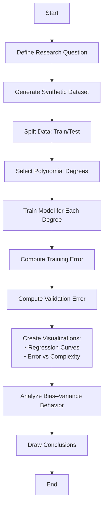

# 🧾 An Experimental Study of Underfitting and Overfitting in Supervised Machine Learning Using Polynomial Regression

## 🎯 Aim

To understand how model complexity affects generalization performance in supervised machine learning.

## 🎯 Objectives

- **Define and understand** underfitting and overfitting
- **Experimentally observe** the effect of model complexity
- **Analyze** training error vs validation error relationships
- **Understand** the bias–variance tradeoff
- **Identify** the optimal model complexity for generalization

## 📌 Problem Statement

In supervised machine learning, selecting an appropriate model complexity is critical for achieving good generalization performance.

**The Challenge:**
- **Too simple models** → fail to capture underlying patterns (underfitting)
- **Too complex models** → memorize noise instead of patterns (overfitting)

**Research Question:**
> How can we experimentally observe and quantify the effects of model complexity on model generalization?

## 🧪 Methodology

### 1️⃣ Data Generation
We generate synthetic nonlinear regression data using:

```
y = sin(x) + noise
```

- **Function**: Sinusoidal pattern to create a known nonlinear relationship
- **Noise**: Gaussian noise added to simulate real-world uncertainty
- **Purpose**: Controlled environment to study model behavior

### 2️⃣ Data Splitting
The dataset is split into:

| Split | Purpose |
|-------|---------|
| **Training Set** | Model learning and parameter fitting |
| **Validation Set** | Generalization performance evaluation |

### 3️⃣ Model Selection
We use **Polynomial Regression** which allows precise control over model complexity via polynomial degree.

| Degree Range | Expected Behavior |
|--------------|------------------|
| 1 | Underfitting (too simple) |
| 4–6 | Good fit (optimal complexity) |
| 15–20 | Overfitting (too complex) |

### 4️⃣ Evaluation Metrics
We compute **Mean Squared Error (MSE)** for:
- Training error (performance on training data)
- Validation error (performance on unseen data)

### 5️⃣ Analysis Approach
- **Visualization**: Plot regression curves for different complexities
- **Error Analysis**: Plot training vs validation error curves
- **Optimization**: Identify complexity where validation error is minimized
- **Theoretical**: Interpret results using bias–variance decomposition

## 🔄 Research Workflow



## 🧠 Theoretical Framework

### Bias-Variance Tradeoff
```
Generalization Error = Bias² + Variance + Irreducible Noise
```

| Model Complexity | Bias | Variance | Result |
|------------------|------|----------|--------|
| **Low** (Simple) | High ↑ | Low ↓ | Underfitting |
| **Optimal** | Balanced | Balanced | Good Generalization |
| **High** (Complex) | Low ↓ | High ↑ | Overfitting |

### Expected Error Behavior

```
Model Complexity →

         Validation Error
              ↑
              |     ╭─╮
              |    ╱   ╲
              |   ╱     ╲
              |  ╱       ╲
              | ╱         ╲
   Training   |╱___________╲___
   Error      |             ╲
              |______________╲____→
           Under-   Optimal   Over-
           fitting            fitting
```

## 📊 Current Progress & Status

### ✅ **Completed Implementation**
| Component | Status | Description |
|-----------|--------|--------------|
| **Data Generation** | ✅ Complete | Synthetic sin(x) + noise generation with configurable parameters |
| **Model Training** | ✅ Complete | Polynomial regression with degree control and MSE evaluation |
| **Visualization** | ✅ Complete | Regression curve plots and error curve visualization functions |
| **Project Setup** | ✅ Complete | Virtual environment, dependencies, and proper project structure |
| **Documentation** | ✅ Complete | Comprehensive README with theory and methodology |
| **Jupyter Notebook** | ✅ Complete | Interactive experiment analysis setup |
| **Version Control** | ✅ Complete | Git repository with proper .gitignore and initial commit |

### 🔬 **Initial Experiment Setup**
- **Data Generated**: 100 synthetic data points using y = sin(x) + Gaussian noise
- **Train/Test Split**: 70/30 split for proper evaluation
- **Model Degrees Tested**: [1, 5, 15] representing underfitting, good fit, and overfitting
- **Evaluation Metric**: Mean Squared Error (MSE) for both training and test sets
- **Visualization**: Ready to generate regression curves and error plots

## 🎯 Next Steps & Roadmap

### 📈 **Phase 1: Comprehensive Experiment Execution** (Next Week)
1. **Run Full Experiment**
   - Execute complete polynomial degree sweep (1-20)
   - Generate training vs validation error curves
   - Create regression curve visualizations for key degrees
   - Document numerical results and observations

2. **Results Analysis**
   - Identify optimal polynomial degree
   - Quantify bias-variance tradeoff observations
   - Create comprehensive plots showing underfitting → optimal → overfitting transition

### 🔍 **Phase 2: Extended Analysis** (Following Week)
3. **Parameter Sensitivity Study**
   - Test different noise levels (0.1, 0.2, 0.5, 1.0)
   - Vary dataset sizes (50, 100, 200, 500 samples)
   - Compare results across different random seeds

4. **Advanced Visualizations**
   - Create animated plots showing complexity progression
   - Generate bias-variance decomposition plots
   - Add confidence intervals and error bars

### 📝 **Phase 3: Documentation & Presentation** (Final Week)
5. **Results Documentation**
   - Update README with actual experimental findings
   - Create executive summary of key insights
   - Document lessons learned and theoretical confirmations

6. **Report Generation**
   - Compile comprehensive experiment report
   - Create presentation slides summarizing findings
   - Prepare code demonstrations and walkthroughs

## 🚀 Getting Started

### Prerequisites
- Python 3.8 or higher
- Virtual environment (recommended)

### Installation & Setup
```bash
# Clone or download the project
cd overfitting_ml

# Activate virtual environment
source .venv/bin/activate

# Install dependencies (within the activated virtual environment)
pip install -r requirements.txt
```

### Usage
```bash
# Make sure virtual environment is activated
source .venv/bin/activate

# Option 1: Run individual modules for testing
python3 data_generation.py      # Test data generation
python3 model_training.py       # Test model training
python3 visualization.py        # Test visualization functions

# Option 2: Run interactive experiment analysis (Recommended)
jupyter notebook notebooks/experiment_analysis.ipynb

# Option 3: Run complete experiment (when main.py is created)
python3 main.py
```

## 📁 Project Structure
```
overfitting_ml/
├── README.md                    # Project documentation (this file)
├── .gitignore                   # Git ignore rules for Python ML projects
├── requirements.txt             # Python dependencies
├── .venv/                       # Virtual environment (excluded from git)
├── data_generation.py           # ✅ Synthetic data generation functions
├── model_training.py            # ✅ Polynomial regression training & evaluation
├── visualization.py             # ✅ Plotting functions for analysis
├── notebooks/
│   └── experiment_analysis.ipynb # ✅ Interactive Jupyter notebook for experiments
└── results/ (to be created)
    ├── plots/                   # 📊 Generated regression and error curve plots
    ├── metrics/                 # 📈 Numerical results and MSE data
    └── reports/                 # 📝 Analysis summaries and findings
```

### 🔧 **Current File Status**
- ✅ **Core modules**: All implemented and tested
- ✅ **Dependencies**: Installed and configured
- ✅ **Notebook**: Ready for interactive experimentation
- 📋 **Results folder**: Will be created during first experiment run

## 🔬 Key Learning Outcomes

- **Practical Understanding** of underfitting vs overfitting
- **Hands-on Experience** with model complexity tuning
- **Visualization Skills** for model evaluation
- **Theoretical Connection** between bias-variance tradeoff and real results

## 📚 References

- Hastie, T., Tibshirani, R., & Friedman, J. (2009). *The Elements of Statistical Learning*
- Bishop, C. M. (2006). *Pattern Recognition and Machine Learning*
- James, G., Witten, D., Hastie, T., & Tibshirani, R. (2013). *An Introduction to Statistical Learning*

---

**Author**: Patrick Filima  
**Date**: February 2026  
**Course**: Machine Learning Fundamentals# underfitting-overfitting-ml-experiment
