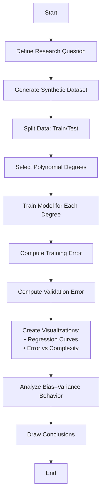

# 🧾 An Experimental Study of Underfitting and Overfitting in Supervised Machine Learning Using Polynomial Regression

## 🎯 Aim

To understand how model complexity affects generalization performance in supervised machine learning.

## 🎯 Objectives

- **Define and understand** underfitting and overfitting
- **Experimentally observe** the effect of model complexity
- **Analyze** training error vs validation error relationships
- **Understand** the bias–variance tradeoff
- **Identify** the optimal model complexity for generalization

## 📌 Problem Statement

In supervised machine learning, selecting an appropriate model complexity is critical for achieving good generalization performance.

**The Challenge:**
- **Too simple models** → fail to capture underlying patterns (underfitting)
- **Too complex models** → memorize noise instead of patterns (overfitting)

**Research Question:**
> How can we experimentally observe and quantify the effects of model complexity on model generalization?

## 🧪 Methodology

### 1️⃣ Data Generation
We generate synthetic nonlinear regression data using:

```
y = sin(x) + noise
```

- **Function**: Sinusoidal pattern to create a known nonlinear relationship
- **Noise**: Gaussian noise added to simulate real-world uncertainty
- **Purpose**: Controlled environment to study model behavior

### 2️⃣ Data Splitting
The dataset is split into:

| Split | Purpose |
|-------|---------|
| **Training Set** | Model learning and parameter fitting |
| **Validation Set** | Generalization performance evaluation |

### 3️⃣ Model Selection
We use **Polynomial Regression** which allows precise control over model complexity via polynomial degree.

| Degree Range | Expected Behavior |
|--------------|------------------|
| 1 | Underfitting (too simple) |
| 4–6 | Good fit (optimal complexity) |
| 15–20 | Overfitting (too complex) |

### 4️⃣ Evaluation Metrics
We compute **Mean Squared Error (MSE)** for:
- Training error (performance on training data)
- Validation error (performance on unseen data)

### 5️⃣ Analysis Approach
- **Visualization**: Plot regression curves for different complexities
- **Error Analysis**: Plot training vs validation error curves
- **Optimization**: Identify complexity where validation error is minimized
- **Theoretical**: Interpret results using bias–variance decomposition

## 🔄 Research Workflow



## 🧠 Theoretical Framework

### Bias-Variance Tradeoff
```
Generalization Error = Bias² + Variance + Irreducible Noise
```

| Model Complexity | Bias | Variance | Result |
|------------------|------|----------|--------|
| **Low** (Simple) | High ↑ | Low ↓ | Underfitting |
| **Optimal** | Balanced | Balanced | Good Generalization |
| **High** (Complex) | Low ↓ | High ↑ | Overfitting |

### Expected Error Behavior

```
Model Complexity →

         Validation Error
              ↑
              |     ╭─╮
              |    ╱   ╲
              |   ╱     ╲
              |  ╱       ╲
              | ╱         ╲
   Training   |╱___________╲___
   Error      |             ╲
              |______________╲____→
           Under-   Optimal   Over-
           fitting            fitting
```

## 📊 Expected Results

| Model State | Training Error | Validation Error | Bias | Variance | Interpretation |
|-------------|----------------|------------------|------|----------|----------------|
| **Underfitting** | High | High | High | Low | Cannot capture pattern |
| **Good Fit** | Low | Low | Balanced | Balanced | Optimal generalization |
| **Overfitting** | Very Low | High | Low | High | Memorizes training noise |

## 🏁 Expected Conclusions

1. **Optimal Complexity Exists**: There is a sweet spot that minimizes validation error
2. **U-shaped Validation Curve**: Validation error decreases then increases with complexity
3. **Generalization Gap**: Overfitting creates a large gap between training and validation performance
4. **Bias-Variance Tradeoff**: Confirms theoretical predictions about bias and variance behavior

## 🚀 Getting Started

### Prerequisites
```bash
pip install numpy matplotlib scikit-learn
```

### Usage
```bash
# Clone or download the project
cd overfitting_ml

# Activate virtual environment
source .venv/bin/activate

# Run the experiment
python main.py
```

## 📁 Project Structure
```
overfitting_ml/
├── README.md
├── .venv/
├── src/
│   ├── data_generation.py
│   ├── model_training.py
│   └── visualization.py
├── notebooks/
│   └── experiment_analysis.ipynb
├── results/
│   ├── plots/
│   └── metrics/
└── requirements.txt
```

## 🔬 Key Learning Outcomes

- **Practical Understanding** of underfitting vs overfitting
- **Hands-on Experience** with model complexity tuning
- **Visualization Skills** for model evaluation
- **Theoretical Connection** between bias-variance tradeoff and real results

## 📚 References

- Hastie, T., Tibshirani, R., & Friedman, J. (2009). *The Elements of Statistical Learning*
- Bishop, C. M. (2006). *Pattern Recognition and Machine Learning*
- James, G., Witten, D., Hastie, T., & Tibshirani, R. (2013). *An Introduction to Statistical Learning*

---

**Author**: Patrick Filima  
**Date**: February 2026  
**Course**: Machine Learning Fundamentals# underfitting-overfitting-ml-experiment
